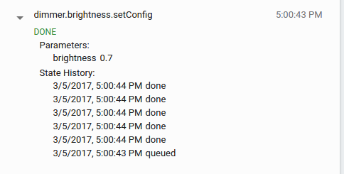

# Problems summery?
- goog_lock.c:25, ```uint16_t GoogLock_get_trait_count_(IotaInterface* self)```
  - parameter passed in is IotaInterface type, but it is casted to GoogLock type.
  - GoogLock is a super set of IotaInterface. This means that when the ```self``` is really a IotaInterface, will there be problems?
  - Parameter does say it is a "Base IotaInterface* version of the get_trait_count method". Why do we need this version of method?
- It seems that device type is determined by manifest_id. And only provided set of manifest_id can be registered.
  - When an invalid manifest_id is provided, there will be some error message and a segfault.
  -
```
[(0000000.000)I dev_framework.c:532] Starting lock example.
[(0000000.000)I dev_framework.c:535] Heap state at app_start: free=0, iota_allocated=0, iota_max_allocated=0
[(0000000.000)I dev_framework.c:492] Heap state at dev_framework_init: free=0, iota_allocated=0, iota_max_allocated=0
[(0000000.000)I daemon.c:266] Daemon thread started.
[(0000000.000)I main.c:17] Inside create_lock_daemon_
[(0000000.000)I goog_samrtlock.c:68] Heap state at GoogLock_interface_create: free=0, iota_allocated=328, iota_max_allocated=328
[(0000000.000)E device.c:111] Model manifest id and device code do not match.
[(0000000.000)E main.c:31] Device create from interface failed
Segmentation fault (core dumped)
```
  - ```manifest_id```'s first two character must match ```someDevice_DeviceKindCode```.
  - If hack ```kGoogLock_DeviceKindCode``` in goog_smartlock.c together with manifest_id, there will be error when register. Confirmed.
  - However, we can still add more traits into those preset device types.
  - One problem: cannot run command for newly added lock traits.
- Cannot register device after deleting the device for iota cloud console. Status shows 1005, which is kIotaStatusRegistrationExists in code.
  - Related code at: ```src/cloud/weave_register.c:242```.
  - SOLUTION: in daemon console, run iota-wipeout, then iota-register. Took forever to figure this out.


### Continue duplicate PATCH request test on libiota
- segfault is not happending in the second ```cloud->providers->httpc->send_request(cloud->providers->httpc,&request, NULL);```, but after send_()
- which means the duplicate PATCH request is sent out already :)
- that's how it looks like when duplicate PATCH are sent to server
- does not see any actually negative impact towards the cloud server.
- maybe one PATCH request is just one entry of log data.


### tcpreplay continued

```
~/workspace/research/iot_stuff/libiota > $ (master) sudo tcpreplay -intf1=wlp3s0 ../wireshark_data/one_request_to_fcm_google.pcapng

Fatal Error in tcpreplay.c:post_args() line 455:
 Invalid interface name/alias: ntf1=wlp3s0
~/workspace/research/iot_stuff/libiota > $ (master) sudo tcpreplay -intf1=lo ../wireshark_data/one_request_to_fcm_google.pcapng

Fatal Error in tcpreplay.c:post_args() line 455:
 Invalid interface name/alias: ntf1=lo
 Invalid interface name/alias: ntf1=lo
```

correction: it's -i wlp3s0 or --ntf1=wlp3s0

##### Results:
-  Cannot see any impact towards anything.
-  Didn't see any response in any way.
-  GCM token expires every few minutes (very short), may need to use re-captured packets every period of time to apply actual effect.

Try tcpliveplay: http://tcpreplay.synfin.net/wiki/tcpliveplay

### Segfault hunt
......

### Device implementation
 - Every device is defined as a struct, with a interface and several traits. Example:

```
struct GoogLight_ {
  IotaInterface base;
  GoogOnOff* power_switch;
  GoogBrightness* dimmer;
  GoogColorXy* color_xy;
  GoogColorTemp* color_temp;
  GoogColorMode* color_mode;
};
```
- ```IotaInterface``` contains basic informations and some basic interface function stubs
- device related files (3 sets and one main.c)
  - examples/common/devices/smartlock.*
  - examples/common/devices/smartlock_traits.*
  - examples/common/devices/host/lock/*
  - src/schema/interfaces/goog_smartlock.c
    - In ```GoogSmartLock* GoogSmartLock_create(uint32_t optional_components) ``` everyone has power_switch.
  - include/iota/schema/interfaces/goog_smartlock.h

##### C extern keyword
- Extends the visibility of the C variables or C functions
- Declaration vs Definition
  - Declaration of a variable/function declares that the variable/function exists somewhere in the programe but the memory is not allocated
  - Definition not only declare but also allocates memory for that variable/function
  - Declaration can be done nay number of times but definition can be done only once
- extern keyword comes with function declaration by default.
- extern variable is declared but not defined.
